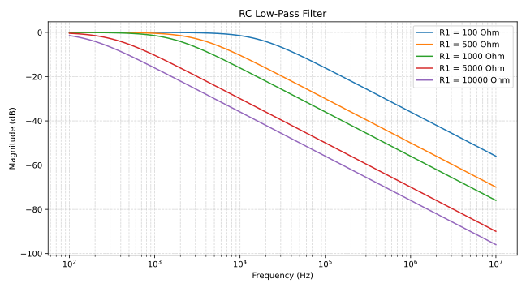

# PyCircuitSim

PyCircuitSim is a Python library for building and simulating analog circuits
using [ngspice](https://ngspice.sourceforge.io/) as the simulation backend.
Circuits can be described either as raw SPICE netlists or built
programmatically through a Python API.

## Requirements

- Python 3.10+
- numpy
- ngspice with shared library support

## Installation

### 1. Install ngspice with shared library support

**Debian / Ubuntu**

```bash
sudo apt install ngspice libngspice0 libngspice0-dev
```

If your distribution does not ship `libngspice0`, you can build ngspice from
source with shared library support. Install the build dependencies first:

```bash
sudo apt install build-essential bison flex libx11-dev libxaw7-dev \
    libreadline-dev libfftw3-dev
```

Then download the latest source tarball from
[ngspice.sourceforge.io](https://ngspice.sourceforge.io/download.html) and
build:

```bash
tar xzf ngspice-*.tar.gz && cd ngspice-*/
mkdir build && cd build
../configure --with-ngshared --disable-debug CFLAGS="-O2"
make -j$(nproc) && sudo make install
sudo ldconfig
```

### 2. Install PyCircuitSim

```bash
pip install git+https://github.com/medwatt/PyCircuitSim.git
```

## Quick Example: Parametric Sweep

The following example runs an AC simulation on an RC low-pass filter while
sweeping the resistor value across five points.

```python
import numpy as np
import matplotlib.pyplot as plt

from pycircuitsim.netlisting import Circuit
from pycircuitsim.simulator import NgSpiceSession, simulations, ParametricSweep

circuit = Circuit("RC Low-Pass Filter")
circuit.V("1", ("in", "0"), dc_value="0", ac_magnitude="1")
circuit.R("1", ("in", "out"), "1k")
circuit.C("1", ("out", "0"), "100n")

session = NgSpiceSession()
session.load_netlist(circuit.get_netlist())

sweep = ParametricSweep(
    component="R1",
    values=[100, 500, 1000, 5000, 10000],
    simulation=simulations.AC(sweep_type="dec", points=20, fstart=100, fstop=10e6),
)

results = session.run(sweep)

fig, ax = plt.subplots(figsize=(9, 5))

for r_val, data in results.items():
    freq = data.frequency.real
    magnitude_db = 20 * np.log10(np.abs(data.voltages["out"]))
    ax.semilogx(freq, magnitude_db, label=f"R1 = {r_val} Ω")

ax.set_xlabel("Frequency (Hz)")
ax.set_ylabel("Magnitude (dB)")
ax.set_title("RC Low-Pass Filter")
ax.legend()
ax.grid(True, which="both", linestyle="--", alpha=0.5)
plt.tight_layout()
plt.show()
```



More examples covering transient analysis, corner analysis, subcircuits, and
the netlisting API can be found in the [`examples/`](examples/) folder.

## Documentation

An in-depth reference covering all simulation types, the netlisting API, and
advanced features is available in [`docs/reference.md`](docs/reference.md).
